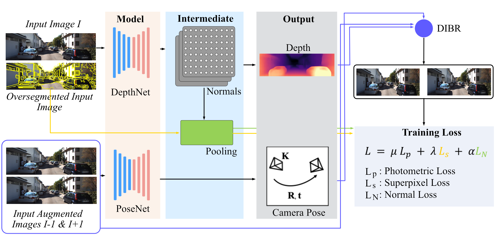
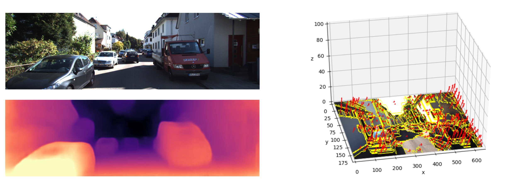

# Piecewise monocular depth estimation by 
plane fitting  

If you find this work interesting please consider reading our [paper](https://github.com/jhd-old/Deep-Learning-Lab/blob/master/meetings/2020_02_14_endterm/endterm_final.pdf)

```
This research is done as part of a research lab at TU Darmstadt by the authors 
Jan Coccejus, Jan Helge Dörsam, Korbinian Kunst and Felix Wirth 
under the supervision of Jun Hur and Prof. Stefan Roth
```
## Basic Overview

This paper proposes a modified approach for dense depth estimation from monocular images. We model a complex 3D scene via over-segmentation via superpixels as a piecewise planar and rigid approximation. Based on this assumption we represent every planar by surface normals/plane coefficients. In this way we solve the homogeneous depth estimation problem that our baseline architecture Monodepth2 from [Godard et al.](https://github.com/nianticlabs/monodepth2) 2019 suffered. In particular we propose (i) a normal-2-block inside the architecture that estimates surface normal coefficients, (ii) a superpixel-loss that incorporates superpixel information and exploits sharper edges and (iii) a normal loss that ensure homogeneous depth for planar surfaces. We demonstrate the effectiveness of the proposed improvements in an detailed depth-map analysis and show comparable scoring metric with state-of-the-art results on the KITTI Eigen-Zhou split.

<p align="center"></p>

## Results
The depth prediction results and the according over-segmentated image with surface normals plotted beginning in the center of mass for each planar structure. The magnitude has been scaled due to visibility reasons.
On the left the depth map is displayed.
<p align="center"></p>

## Ablation study & comparison with other Networks

In depth display of modification that have been made in this work, including serveral loss functions and two superpixel methods for oversegmentation.

|                         | Decoder  | Inp. Channels | Sup. Method | Loss Function           | Abs Rel | Sq Rel | RSME   | RSME log | δ<1.25 | δ<1.25² | δ<1.25³ |
|-------------------------|----------|---------------|-------------|-------------------------|---------|--------|--------|----------|-------|---------|---------|
| Baseline                | standard | 3             |             | standard                | 0.115   | 0.903  | 4.863  | 0.193    | 0.877 | 0.959   | 0.981   |
| N2D                     | normals  | 3             |             | standard                | 0.123   | 0.984  | 5.042  | 0.2      | 0.859 | 0.955   | 0.98    |
| 4Ch                     | standard | 4             | felzenwalb  | standard                | 0.141   | 1.313  | 5.545  | 0.22     | 0.834 | 0.942   | 0.974   |
| 4Ch                     | standard | 4             | slic        | standard                | 0.255   | 2.237  | 7.892  | 0.342    | 0.594 | 9.832   | 0.927   |
| 6Ch                     | standard | 6             | felzenwalb  | standard                | 0.122   | 0.978  | 5.026  | 0.2      | 0.862 | 0.955   | 0.979   |
| 4Ch + N2D               | normals  | 4             | felzenwalb  | standard                | 0.142   | 1.262  | 5.551  | 0.22     | 0.83  | 0.942   | 0.975   |
| 4Ch + N2D + bin         | normals  | 4             | felzenwalb  | binary                  | 0.443   | 4.757  | 12.083 | 0.588    | 0.303 | 0.561   | 0.766   |
| 3Ch + N2D + bin         | normals  | 3             |             | binary                  | 0.443   | 4.757  | 12.083 | 0.588    | 0.303 | 0.561   | 0.766   |
| 4Ch + N2D + cont        | normals  | 4             | felzenwalb  | continous               | 0.138   | 1.185  | 5.484  | 0.218    | 0.832 | 0.944   | 0.975   |
| 4Ch + N2D + cont        | normals  | 4             | slic        | continous               | 0.443   | 4.757  | 12.083 | 0.588    | 0.303 | 0.561   | 0.766   |
| 3Ch + N2D + cont        | normals  | 3             |             | continous               | 0.443   | 4.757  | 12.083 | 0.588    | 0.303 | 0.561   | 0.766   |
| 4Ch + N2D +  0.001 norm | normals  | 4             | felzenwalb  | 0.001 * normal          | 0.139   | 1.193  | 5.525  | 0.22     | 0.831 | 0.941   | 0.974   |
| 4Ch + N2D +  0.01 norm  | normals  | 4             | felzenwalb  | 0.01 * normal           | 0.139   | 1.172  | 5.513  | 0.218    | 0.831 | 0.942   | 0.975   |
| 4Ch + N2D +  0.1 norm   | normals  | 4             | felzenwalb  | 0.1 * normal            | 0.443   | 4.757  | 12.083 | 0.588    | 0.303 | 0.561   | 0.766   |
| 4Ch + N2D + bin + norm  | normals  | 4             | felzenwalb  | binary + normal         | 0.443   | 4.757  | 12.083 | 0.588    | 0.303 | 0.561   | 0.766   |
| 4Ch + N2D + cont + norm | normals  | 4             | felzenwalb  | continous + normal loss | 0.141   | 1.276  | 5.549  | 0.221    | 0.832 | 0.941   | 0.974   |
| 4Ch + N2D + cont + norm | normals  | 4             | slic        | continous & normal      | 0.443   | 4.757  | 12.083 | 0.588    | 0.303 | 0.561   | 0.766   |
| 3Ch+ N2D + cont + norm  | normals  | 3             |             | continous + normal      | 0.443   | 4.757  | 12.083 | 0.588    | 0.303 | 0.561   | 0.766   |
